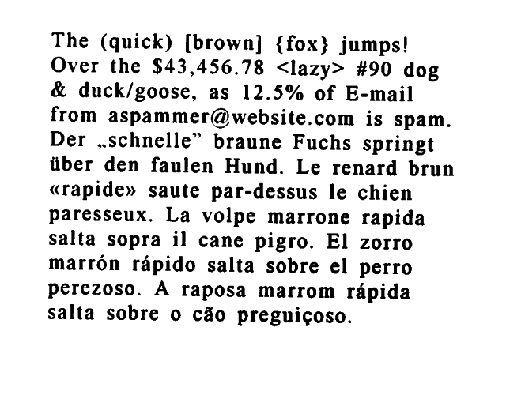
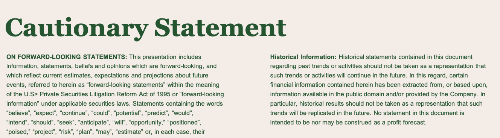
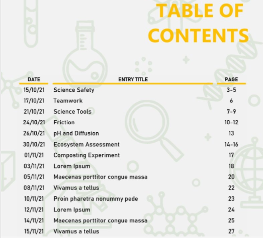

# Command Line Usage

## [Tesseract 'man' page](https://github.com/tesseract-ocr/tesseract/blob/main/doc/tesseract.1.asc)

See the [man](https://github.com/tesseract-ocr/tesseract/blob/main/doc/tesseract.1.asc) page for command line syntax and other details.

## FAQ

See [FAQ](FAQ.md#running-tesseract) for more examples and tips.

--------------------------------------------

## Available OCR Engines in Tesseract 5

Use `--oem 1` for LSTM/neural network, `--oem 0` for Legacy Tesseract. 

Please note that Legacy Tesseract models are included in traineddata files from [tessdata](https://github.com/tesseract-ocr/tessdata) repo only.

   `tesseract input.tiff output --oem 1 -l eng`

---------------------------------------------

## Simplest Invocation to OCR an image

    tesseract imagename outputbase

This uses **English** as the default language and 3 as the Page Segmentation Mode. The default output format is **text**.

osd.traineddata, for Orientation and Segmentation and eng.traineddata and other language data files for English should be in the "tessdata" directory. TESSDATA_PREFIX environment variable should be set to the parent directory of "tessdata" directory. 

The following command would give the same result as above, if eng.traineddata and osd.traineddata files are in /usr/share/tessdata directory.

    tesseract --tessdata-dir /usr/share imagename outputbase -l eng --psm 3

--------------------------------------------

Following examples use this image which has text in multiple languages.



## Using One Language

Add '-l LANG' to the command where LANG is three character language code from the list of supported languages. If this is not given then English language is assumed by default.

    tesseract images/eurotext.png - -l eng

Output 

```
The (quick) [brown] {fox} jumps!
Over the $43,456.78 <lazy> #90 dog
& duck/goose, as 12.5% of E-mail
from aspammer@website.com is spam.
Der ,schnelle” braune Fuchs springt
iiber den faulen Hund. Le renard brun
«rapide» saute par-dessus le chien
paresseux. La volpe marrone rapida
salta sopra il cane pigro. El zorro
marrén rapido salta sobre el perro
perezoso. A raposa marrom ripida
salta sobre o cdo preguigoso.
```

## Using Multiple Languages

Add `-l LANG[+LANG]` to the command line to use multiple languages together for recognition 

    tesseract images/eurotext.png - -l eng+deu

Output

```
The (quick) [brown] {fox} jumps!
Over the $43,456.78 <lazy> #90 dog
& duck/goose, as 12.5% of E-mail
from aspammer@website.com is spam.
Der „schnelle” braune Fuchs springt
über den faulen Hund. Le renard brun
«rapide» saute par-dessus le chien
paresseux. La volpe marrone rapida
salta sopra il cane pigro. El zorro
marrén rapido salta sobre el perro
perezoso. A raposa marrom räpida
salta sobre o cdo preguigoso.
```

--------------------------------------------

## Order of multiple languages

The time taken for OCR as well as the output can be different based on the order of languages.

Following examples use this image which has text in multiple languages - Hindi and English.


### Using English as primary language and then Hindi

```
time tesseract images/bilingual.png - -l eng+hin

Estimating resolution as 638
हिंदी से अंग्रेजी
HINDI TO
ENGLISH

real    0m0.442s
user    0m0.622s
sys     0m0.062s

```

### Using Hindi as primary language and then English

```
time tesseract images/bilingual.png - -l hin+eng

Estimating resolution as 638
हिंदी से अंग्रेजी
HINDI TO
ENGLISH

real    0m0.429s
user    0m0.550s
sys     0m0.074s
```

### Using script/Devanagari as primary language (it supports all languages in Devanagari script and English)

```
time tesseract images/bilingual.png - -l script/Devanagari

Estimating resolution as 638
हिंदी से अंग्रेजी
HINDI TO
ENGLISH

real    0m0.391s
user    0m0.459s
sys     0m0.093s

```

### Use `quiet` configuration to suppress messages

Using `quiet` at end of the above command will suppress the message regarding image resolution.

```
time tesseract images/bilingual.png - -l script/Devanagari quiet

हिंदी से अंग्रेजी
HINDI TO
ENGLISH

real    0m0.416s
user    0m0.494s
sys     0m0.091s
```
--------------------------------------------

## Searchable pdf output

    tesseract testing/eurotext.png testing/eurotext-eng -l eng pdf

This creates a pdf with the image and a separate searchable text layer with the recognized text.

--------------------------------------------

## HOCR output

Use 'hocr' config file by adding hocr at the end of the command to get the HOCR output.

    tesseract images/eurotext.png - -l eng hocr

Partial Output

```
<?xml version="1.0" encoding="UTF-8"?>
<!DOCTYPE html PUBLIC "-//W3C//DTD XHTML 1.0 Transitional//EN"
    "http://www.w3.org/TR/xhtml1/DTD/xhtml1-transitional.dtd">
<html xmlns="http://www.w3.org/1999/xhtml" xml:lang="en" lang="en">
 <head>
  <title></title>
  <meta http-equiv="Content-Type" content="text/html;charset=utf-8"/>
  <meta name='ocr-system' content='tesseract 5.0.1-64-g3c22' />
  <meta name='ocr-capabilities' content='ocr_page ocr_carea ocr_par ocr_line ocrx_word ocrp_wconf'/>
 </head>
 <body>
  <div class='ocr_page' id='page_1' title='image "images/eurotext.png"; bbox 0 0 640 500; ppageno 0; scan_res 300 300'>
   <div class='ocr_carea' id='block_1_1' title="bbox 61 41 574 413">
    <p class='ocr_par' id='par_1_1' lang='eng' title="bbox 61 41 574 413">
     <span class='ocr_line' id='line_1_1' title="bbox 65 41 515 71; baseline 0.013 -11; x_size 25; x_descenders 5; x_ascenders 6">
      <span class='ocrx_word' id='word_1_1' title='bbox 65 41 111 61; x_wconf 96'>The</span>
      <span class='ocrx_word' id='word_1_2' title='bbox 128 42 217 66; x_wconf 95'>(quick)</span>
      <span class='ocrx_word' id='word_1_3' title='bbox 235 43 330 68; x_wconf 95'>[brown]</span>
      <span class='ocrx_word' id='word_1_4' title='bbox 349 44 415 69; x_wconf 94'>{fox}</span>
      <span class='ocrx_word' id='word_1_5' title='bbox 429 45 515 71; x_wconf 96'>jumps!</span>
     </span>

...

     <span class='ocr_line' id='line_1_12' title="bbox 61 385 444 413; baseline 0.013 -9; x_size 24; x_descenders 4; x_ascenders 5">
      <span class='ocrx_word' id='word_1_62' title='bbox 61 385 119 405; x_wconf 92'>salta</span>
      <span class='ocrx_word' id='word_1_63' title='bbox 135 385 200 406; x_wconf 92'>sobre</span>
      <span class='ocrx_word' id='word_1_64' title='bbox 216 392 229 406; x_wconf 83'>o</span>
      <span class='ocrx_word' id='word_1_65' title='bbox 244 388 285 407; x_wconf 80'>cdo</span>
      <span class='ocrx_word' id='word_1_66' title='bbox 300 388 444 413; x_wconf 92'>preguigoso.</span>
     </span>
    </p>
   </div>
  </div>
 </body>
</html>
```
--------------------------------------------

## TSV output

Use 'tsv' config file by adding tsv at the end of the command to get the TSV output.

    tesseract images/eurotext.png - -l eng tsv

Partial Output

```
level   page_num        block_num       par_num line_num        word_num        left    top     width   height  conf    text
1       1       0       0       0       0       0       0       640     500     -1
2       1       1       0       0       0       61      41      513     372     -1
3       1       1       1       0       0       61      41      513     372     -1
4       1       1       1       1       0       65      41      450     30      -1
5       1       1       1       1       1       65      41      46      20      96.063751       The
5       1       1       1       1       2       128     42      89      24      95.965691       (quick)
5       1       1       1       1       3       235     43      95      25      95.835831       [brown]
5       1       1       1       1       4       349     44      66      25      94.899742       {fox}
5       1       1       1       1       5       429     45      86      26      96.683357       jumps!
4       1       1       1       2       0       65      72      490     31      -1
5       1       1       1       2       1       65      72      60      20      96.912064       Over
5       1       1       1       2       2       140     73      37      20      96.887390       the
5       1       1       1       2       3       194     73      139     24      93.263031       $43,456.78
5       1       1       1       2       4       350     76      85      25      90.893219       <lazy>
5       1       1       1       2       5       451     77      44      19      96.820717       #90
5       1       1       1       2       6       511     78      44      25      96.538940       dog
4       1       1       1       3       0       64      103     458     26      -1
```
--------------------------------------------

## Using different Page Segmentation Modes

### --psm 3 - Fully automatic page segmentation, but no OSD. (Default)

Following example uses this image which has text in multiple columns.



    tesseract images/2col.png - --psm 3

```
Cautionary Statement

ON FORWARD-LOOKING STATEMENTS: This presentation includes
information, statements, beliefs and opinions which are forward-looking, and
which reflect current estimates, expectations and projections about future
events, referred to herein as “forward-looking statements” within the meaning
of the U.S> Private Securities Litigation Reform Act of 1995 or “forward-looking
information” under applicable securities laws. Statements containing the words
“believe”, “expect”, “continue”, “could, “potential”, “predict”, “would”,

“intend”, “should”, “seek”, “anticipate”, ‘will’, “opportunity,” “positioned”,

“poised,” “project”, “risk”, “plan”, “may”, “estimate” or, in each case, their

Historical Information: Historical statements contained in this document
regarding past trends or activities should not be taken as a representation that
such trends or activities will continue in the future. In this regard, certain
financial information contained herein has been extracted from, or based upon,
information available in the public domain and/or provided by the Company. In
particular, historical results should not be taken as a representation that such
trends will be replicated in the future. No statement in this document is
intended to be nor may be construed as a profit forecast.
```

### --psm 6 - Assume a single uniform block of text.

Following examples uses this image which has a Table of Contents.



    tesseract images/toc.png - --psm 6

```
Contents

Introduction to the Tenth Anniversary Edition page xvii
Afterword to the Tenth Anniversary Edition xix
Preface xxi
Acknowledgements xxvii
Nomenclature and notation xxix
Part I Fundamental concepts 1
1 Introduction and overview 1
1.1 Global perspectives 1

1.11 History of quantum computation and quantum
information 2
1.1.2 Future directions 12
1.2 Quantum bits 13
1.2.1 Multiple qubits 16
1.3 Quantum computation 17
1.3.1 Single qubit gates 17
1.3.2 Multiple qubit gates 20
1.3.3 Measurements in bases other than the computational basis 2
1.34 Quantum circuits 2
1.3.5 Qubit copying circuit? 24
```

### Use -c preserve_interword_spaces=1 to preserve spaces

    tesseract images/toc.png - --psm 6 -c preserve_interword_spaces=1

```
Contents

Introduction to the Tenth Anniversary Edition                                       page xvii
Afterword to the Tenth Anniversary Edition                                                 xix
Preface                                                                                                         xxi
Acknowledgements                                                                                    xxvii
Nomenclature and notation                                                                        xxix
Part I Fundamental concepts                                                                          1
1 Introduction and overview                                                                              1
1.1 Global perspectives                                                                                 1

1.11 History of quantum computation and quantum
information                                                                                 2
1.1.2 Future directions                                                12
1.2 Quantum bits                                                          13
1.2.1 Multiple qubits                                                     16
1.3 Quantum computation                                                  17
1.3.1 Single qubit gates                                                17
1.3.2 Multiple qubit gates                                                20
1.3.3 Measurements in bases other than the computational basis              2
1.34 Quantum circuits                                                            2
1.3.5 Qubit copying circuit?                                                  24
```

### Use pdftotext for preserving layout for text output

tesseract images/toc.png images/toc -l eng --psm 11 pdf

pdftotext -layout  images/toc.pdf -

```
                                    Contents


Introduction to the Tenth Anniversary Edition                             page xvii
Afterword to the Tenth Anniversary Edition                                      xix
Preface                                                                         xxi
Acknowledgements                                                              xx
Nomenclature and notation                                                      xxix

Part I Fundamental concepts

 1 Introduction and overview
    1.1 Global perspectives
          1.11 History of quantum computation and quantum
                information
          1.1.2 Future directions                                                12
    12 Quantum bits                                                              13
         1.2.1 Multiple qubits                                                   16
    1.3 Quantum computation                                                      17
               Single qubit gates
             2 Multiple qubit gates                                              20
               Measurements in bases other than the computational basis          2
             4 Quantum circu                                                     2
             5 Qubit copying circuit?                                            24
```