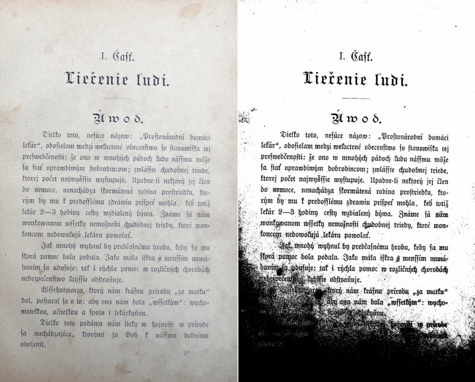
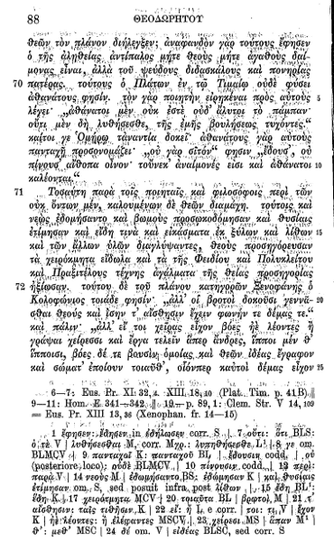
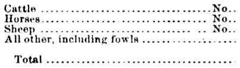

# Improving the quality of the output

There are a variety of reasons you might not get good quality output from Tesseract. It's important to note that, unless you're using a very unusual font or a new language, retraining Tesseract is unlikely to help.


* [Image processing](#image-processing)
  * [Rescaling](#rescaling)
  * [Binarisation](#binarisation)
  * [Noise Removal](#noise-removal)
  * [Dilation / Erosion](#dilation-and-erosion)
  * [Rotation / Deskewing](#rotation--deskewing)
  * [Borders](#borders)
  * [Transparency / Alpha channel](#transparency--alpha-channel)
  * [Tools / Libraries](#tools--libraries)
  * [Examples](#examples)
  * [Tables recognition](#tables-recognition)
* [Page segmentation method](#page-segmentation-method)
* [Dictionaries, word lists, and patterns](#dictionaries-word-lists-and-patterns)
* [Still having problems?](#still-having-problems)


## Image processing

Tesseract does various image processing operations internally (using the Leptonica library) before doing the actual OCR. It generally does a very good job of this, but there will inevitably be cases where it isn't good enough, which can result in a significant reduction in accuracy.

You can see how Tesseract has processed the image by using the [configuration variable](https://github.com/tesseract-ocr/tessdoc/blob/main/tess3/ControlParams.md) `tessedit_write_images` to `true` (or using configfile `get.images`) when running Tesseract. If the resulting `tessinput.tif` file looks problematic, try some of these image processing operations before passing the image to Tesseract. 

### Inverting images

While tesseract version 3.05 (and older) handle inverted image (dark background and light text) without problem, for 4.x version use dark text on light background.

### Rescaling

Tesseract works best on images which have a DPI of at least 300 dpi, so it may be beneficial to resize images. For more information see [the FAQ](https://github.com/tesseract-ocr/tessdoc/blob/main/tess3/FAQ-Old.md#is-there-a-minimum--maximum-text-size-it-wont-read-screen-text).

"Willus Dotkom" made interesting test for [Optimal image resolution](https://groups.google.com/d/msg/tesseract-ocr/Wdh_JJwnw94/24JHDYQbBQAJ) with suggestion for optimal Height of capital letter in pixels.

### Binarisation



This is converting an image to black and white. Tesseract does this internally (Otsu algorithm), but the result can be suboptimal, particularly if the page background is of uneven darkness.

Tesseract 5.0.0 added two new Leptonica based binarization methods: Adaptive Otsu and Sauvola. Use `tesseract --print-parameters | grep thresholding_` to see the relevant configurable parameters.

If you are not able to fix this by providing a better input image, you can try a different algorithm. See [ImageJ Auto Threshold](https://imagej.net/Auto_Threshold) (java) or [OpenCV Image Thresholding](https://docs.opencv.org/master/d7/d4d/tutorial_py_thresholding.html) (python) or [scikit-image Thresholding](https://scikit-image.org/docs/dev/auto_examples/segmentation/plot_thresholding.html) documentation (python).


### Noise Removal



Noise is random variation of brightness or colour in an image, that can make the text of the image more difficult to read. Certain types of noise cannot be removed by Tesseract in the binarisation step, which can cause accuracy rates to drop.

### Dilation and Erosion

Bold characters or Thin characters (especially those with [Serifs](https://en.wikipedia.org/wiki/Serif)) may impact the recognition of details and reduce recognition accuracy.  Many image processing programs allow [Dilation and Erosion](http://www.mif.vu.lt/atpazinimas/dip/FIP/fip-Morpholo.html#Heading96) of edges of characters against a common background to dilate or grow in size (Dilation) or shrink (Erosion).

Heavy ink bleeding from historical documents can be compensated for by using an Erosion technique. Erosion can be used to shrink characters back to their normal glyph structure.

For example, GIMP's Value Propagate filter can create Erosion of extra bold historical fonts by reducing the Lower threshold value.

Original:



Erosion applied:


### Rotation / Deskewing


A skewed image is when a page has been scanned when not straight. The quality of Tesseract's line segmentation reduces significantly if a page is too skewed, which severely impacts the quality of the OCR. To address this rotate the page image so that the text lines are horizontal.


### Borders

#### Missing borders

If you OCR just text area without any border, tesseract could have problems with it. See for some details in [tesseract user forum](https://groups.google.com/forum/?utm_medium=email&utm_source=footer#!msg/tesseract-ocr/v26a-RYPSOE/2Sppq61GBwAJ)[#427](https://github.com/tesseract-ocr/tesseract/issues/427) . You can easy add small border (e.g. 10 px) with [ImageMagick®](http://imagemagick.org/script/index.php):
```
convert  427-1.jpg  -bordercolor White -border 10x10 427-1b.jpg
```

#### Too big borders

Big borders (especially when processing a single letter/digit or one word on a large background) can cause problems ("empty page").
Please try to crop you input image to a text area with reasonable border (e.g. 10 px).


#### Scanning border Removal


Scanned pages often have dark borders around them. These can be erroneously picked up as extra characters, especially if they vary in shape and gradation.


### Transparency / Alpha channel

Some image formats (e.g. png) can have an [alpha-channel](https://www.techopedia.com/definition/1945/alpha-channel) for providing a transparency feature.

Tesseract 3.0x expects that users remove the alpha channel from the image before using the image in tesseract. This can be done e.g. with ImageMagick command:
```
convert input.png -alpha off output.png
```

Tesseract 4.00 removes the alpha channel with leptonica function [pixRemoveAlpha()](https://github.com/DanBloomberg/leptonica/blob/648a3be52b6a004df14671de7004416f9a3ce489/src/pixconv.c#L133): it removes the alpha component by blending it with a white background. In some cases (e.g. OCR of [movie subtitles](https://github.com/tesseract-ocr/tesseract/issues/2048#issuecomment-438015376)) this can lead to problems, so users would need to remove the alpha channel (or pre-process the image by inverting image colors) by themselves.

### Tools / Libraries

* [Leptonica](http://leptonica.com)
* [OpenCV](http://opencv.org/)
* [ScanTailor Advanced](https://github.com/4lex4/scantailor-advanced#-scantailor-advanced)
* [ImageMagick](http://www.imagemagick.org)
* [unpaper](https://www.flameeyes.eu/projects/unpaper)
* [ImageJ](http://rsb.info.nih.gov/ij/)
* [Gimp](http://www.gimp.org)
* [PRLib](https://github.com/leha-bot/PRLib) - Pre-Recognize Library with algorithms for improving OCR quality

### Examples

If you need an example how to improve image quality programmatically, have a look at this examples:

* [OpenCV - Rotation (Deskewing)](http://felix.abecassis.me/2011/10/opencv-rotation-deskewing/) - c++ example
* [Fred's ImageMagick TEXTCLEANER](http://www.fmwconcepts.com/imagemagick/textcleaner/index.php) - bash script for processing a scanned document of text to clean the text background.
* [rotation\_spacing.py](https://gist.github.com/endolith/334196bac1cac45a4893#) - python script for automatic detection of rotation and line spacing of an image of text
* [crop\_morphology.py](https://github.com/danvk/oldnyc/blob/master/ocr/tess/crop_morphology.py) - [Finding blocks of text in an image using Python, OpenCV and numpy](http://www.danvk.org/2015/01/07/finding-blocks-of-text-in-an-image-using-python-opencv-and-numpy.html)
* [Credit card OCR with OpenCV and Python](https://www.pyimagesearch.com/2017/07/17/credit-card-ocr-with-opencv-and-python)
* [noteshrink](https://github.com/mzucker/noteshrink) - python example how to clean up scans. Details in blog [Compressing and enhancing hand-written notes](https://mzucker.github.io/2016/09/20/noteshrink.html).
* [uproject text](https://github.com/mzucker/unproject_text) - python example how to recover perspective of image. Details in blog [Unprojecting text with ellipses](https://mzucker.github.io/2016/10/11/unprojecting-text-with-ellipses.html).
* [page_dewarp](https://github.com/mzucker/page_dewarp) - python example for Text page dewarping using a "cubic sheet" model. Details in blog [Page dewarping](https://mzucker.github.io/2016/08/15/page-dewarping.html).
* [How to remove shadow from scanned images using OpenCV](https://stackoverflow.com/questions/44752240/how-to-remove-shadow-from-scanned-images-using-opencv)


## Page segmentation method

By default Tesseract expects a page of text when it segments an image. If you're just seeking to OCR a small region, try a different segmentation mode, using the `--psm` argument. Note that adding a white border to text which is too tightly cropped may also help, see [issue 398](https://web.archive.org/web/20151209085049/https://code.google.com/p/tesseract-ocr/issues/detail?id=398).

To see a complete list of supported page segmentation modes, use `tesseract -h`. Here's the list as of 3.21:

```
  0    Orientation and script detection (OSD) only.
  1    Automatic page segmentation with OSD.
  2    Automatic page segmentation, but no OSD, or OCR.
  3    Fully automatic page segmentation, but no OSD. (Default)
  4    Assume a single column of text of variable sizes.
  5    Assume a single uniform block of vertically aligned text.
  6    Assume a single uniform block of text.
  7    Treat the image as a single text line.
  8    Treat the image as a single word.
  9    Treat the image as a single word in a circle.
 10    Treat the image as a single character.
 11    Sparse text. Find as much text as possible in no particular order.
 12    Sparse text with OSD.
 13    Raw line. Treat the image as a single text line,
			bypassing hacks that are Tesseract-specific.
```

## Dictionaries, word lists, and patterns

By default Tesseract is optimized to recognize sentences of words. If you're trying to recognize something else, like receipts, price lists, or codes, there are a few things you can do to improve the accuracy of your results, as well as double-checking that the appropriate [segmentation method](#page-segmentation-method) is selected.

Disabling the dictionaries Tesseract uses should increase recognition if most of your text isn't dictionary words. They can be disabled by setting both of the [configuration variables](tess3/ControlParams.md) `load_system_dawg` and `load_freq_dawg` to `false`.

It is also possible to add words to the word list Tesseract uses to help recognition, or to add common character patterns, which can further help to improve accuracy if you have a good idea of the sort of input you expect. This is explained in more detail in the [Tesseract manual](https://github.com/tesseract-ocr/tesseract/blob/main/doc/tesseract.1.asc#config-files-and-augmenting-with-user-data).

If you know you will only encounter a subset of the characters available in the language, such as only digits, you can use the `tessedit_char_whitelist` [configuration variable](tess3/ControlParams.md). See the [FAQ for an example](tess3/FAQ-Old.md#how-do-i-recognize-only-digits).

## Tables recognition

It is known tesseract has a problem to recognize text/data from tables (see [issues tracker](https://github.com/tesseract-ocr/tesseract/issues)) without custom segmentation/layout analysis. You can try to use/test [Sintun proposal](https://github.com/tesseract-ocr/tesseract/issues/1714#issuecomment-588183356) or get some ideas from [Text Extraction from a Table Image, using PyTesseract and OpenCV](https://fazlurnu.com/2020/06/23/text-extraction-from-a-table-image-using-pytesseract-and-opencv)/[code for Text-Extraction-Table-Image](https://github.com/fazlurnu/Text-Extraction-Table-Image)

## Still having problems?

If you've tried all the above and are still getting low accuracy results, [ask on the forum](https://groups.google.com/forum/?fromgroups#!forum/tesseract-ocr) for help, ideally posting an example image.
