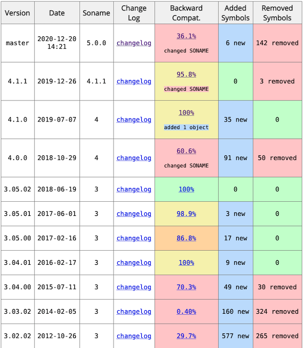

# Release Notes

This page keeps the most up-to-date release notes.

Table of Contents
=================
* [IN DEVELOPMENT](ReleaseNotes.md#in-development)
* [Jul 06 2022 - V5.2.0](ReleaseNotes.md#tesseract-release-notes-jul-06-2022---v520)
* [Mar 01 2022 - V5.1.0](ReleaseNotes.md#tesseract-release-notes-mar-01-2022---v510)
* [Jan 07 2022 - V5.0.1](ReleaseNotes.md#tesseract-release-notes-jan-07-2022---v501)
* [Nov 30 2021 - V5.0.0](ReleaseNotes.md#tesseract-release-notes-nov-30-2021---v500)
* [Nov 15 2021 - V4.1.3](ReleaseNotes.md#tesseract-release-notes-nov-15-2021---v413)
* [Nov 14 2021 - V4.1.2](ReleaseNotes.md#tesseract-release-notes-nov-14-2021---v412)
* [Dec 26 2019 - V4.1.1](#tesseract-release-notes-dec-26-2019---v411)
* [Jul 07 2019 - V4.1.0](#tesseract-release-notes-jul-07-2019---v410)
* [Oct 29 2018 - V4.0.0](#tesseract-release-notes-oct-29-2018---v400)
* [June 19 2018 - V3.05.02](#tesseract-release-notes-june-19-2018---v30502)
* [June 1 2017 - V3.05.01](#tesseract-release-notes-june-1-2017---v30501)
* [February 16 2017 - V3.05.00](#tesseract-release-notes-feb-16-2017---v30500)
* [February 16 2016 - V3.04.01](#tesseract-release-notes-feb-16-2016---v30401)
* [July 11 2015 - V3.04.00](#tesseract-release-notes-july-11-2015---v30400)
* [February 4 2014 - V3.03(rc1)](#tesseract-release-notes-feb-4-2014---v303rc1)
* [October 23 2012 - V3.02.02](#tesseract-release-notes-oct-23-2012---v30202)
* [October 21 2011 - V3.01](#tesseract-release-notes-oct-21-2011---v301)
* [September 30 2010 - V3.00](#tesseract-release-notes-sep-30-2010---v300)
* [June 30 2009 - V2.04](#tesseract-release-notes-june-30-2009---v204)
* [April 22 2008 - V2.03](#tesseract-release-notes-april-22-2008---v203)
* [April 21 2008 - V2.02](#tesseract-release-notes-april-21-2008---v202)
* [August 30 2007 - V2.01](#tesseract-release-notes-aug-30-2007---v201)
* [July 18 2007 - V2.00](#tesseract-release-notes-jul-18-2007---v200)
* [May 15 2007 - V1.04](#tesseract-release-notes-may-15-2007---v104)
* [February 03 2007 - V1.03](#tesseract-release-notes-february-03-2007---v103)
* [October 04 2006 - V1.02](#tesseract-release-notes-october-04-2006---v102)
* [September 07 2006 - V1.01](#tesseract-release-notes-september-07-2006---v101)
* [June 17 2006 - V1.00](#tesseract-release-notes-june-17-2006---v100)

# IN DEVELOPMENT

## [API/ABI changes review for Tesseract](https://abi-laboratory.pro/?view=timeline&l=tesseract)





* [Binary compatibility report for Tesseract: 4.1.1 vs main (will be 5.0)](https://abi-laboratory.pro/index.php?view=objects_report&l=tesseract&v1=4.1.1&v2=current)
* [Binary compatibility report for Tesseract: 4.1.0 vs 4.1.1](https://abi-laboratory.pro/index.php?view=objects_report&l=tesseract&v1=4.1.0&v2=4.1.1)
* [Binary compatibility report for Tesseract: 4.0.0 vs 4.1.0](https://abi-laboratory.pro/index.php?view=objects_report&l=tesseract&v1=4.0.0&v2=4.1.0)
* [Binary compatibility report for Tesseract: 3.05.02 vs 4.0.0](https://abi-laboratory.pro/index.php?view=objects_report&l=tesseract&v1=3.05.02&v2=4.0.0)

# Tesseract release notes Dec ?? 2022 - V5.3.0

* Fix the training tools for the legacy OCR engine (issue 3925).
* PDF renderer: Ignore non-text blocks (fix issue 3957).
* Remove colormap before thresholding (fix issue 3940).
* Fix a number of performance issues reported by Coverity Scan.
* Training tools: Replace call of exit function by return statement in main function.
* Fix double free in function vigorous_noise_removal (fix issue 3876).
* Create to_win if needed in Textord::make_spline_rows (fix issue 3875).
* Fix memory issues in ScrollView::MessageReceiver.
* Catch potential nullptr in SVNetwork::SVNetwork.
* Fix AMD64 detection with Autotools on FreeBSD.
* Move `svpaint.cpp` from `src/viewer` to `src/`. Add rule for svpaint executable in Autotools.
* Fix `tesseract.pc` generated from CMake to match Autotools.

# Tesseract release notes Jul 06 2022 - V5.2.0

* Add initial support for Intel AVX512F. This improves the performance for recognition with the 'best' models and for training.
* C API: Add a function to init tesseract with traineddata from memory.
* Add a new parameter `invert_threshold`. The default value is `0.7`. In previous 5.x versions, the inversion threshold was `0.5`, without a way to change this value by the user. The `tessedit_do_invert` paramerer is deprecated and will be removed in version 6.0. To completely disable textlines inversion, you can set `invert_threshold` value to `0.0`.
* Fix regression with UZN files.
* Replace direct access to Leptonica internal data structures by function calls (this is necessary for compatibility with the next Leptonica release).
* Replace `std::regex` by `std::string` functions (issue [#3830](https://github.com/tesseract-ocr/tesseract/issues/3830)).
* Fix for very large PDF files on 32 bit hosts.
* Set `/Os` for AVX2 code when compiled with some versions of the 32-bit MSVC compiler (issue [#3769](https://github.com/tesseract-ocr/tesseract/issues/3769)).
* Use compiled-in `TESSDATA_PREFIX` also on Windows.
* C API: Fix calling `delete[]` for memory allocated by `malloc`.
* Improve CI builds definitions.
* Improve Autotools and CMake builds definitions.

# Tesseract release notes Mar 01 2022 - V5.1.0

* Handle image and line separator regions in ALTO, hOCR and text output formats. 
* Few other enhancements.
* Small set of bug fixes.
* Remove unused code.
* Raise minimum required CMake version to 3.10.

# Tesseract release notes Jan 07 2022 - V5.0.1

* Fix broken msys2 build with GCC 11.
* Support up to 8 redirections when running OCR on a URL.
* Catch `nullptr` in `STATS::pile_count()`.
* Remove `NetworkIO::ZeroTimeStepGeneral()`. This allows more inline code (optimization).
* Update generator for lookup tables to use `TFloat` instead of `double`.
* Fix clang compiler warnings in `functions.h`. The new code avoids some conversions between `double` and `float`, so it should also have a small positive effect on the performance.
* Fix compiler warning [`-Wsign-compare`].
* Fix compiler warnings caused by empty statements.
* Fix some other compiler warnings.
* Remove unused code.
* Add `SPDX-License-Identifier` to public include files.

CMake build:
* Correctly detect `amd64`, `x86_64`, `i386` and `i686` targets.
* Do not try to configure training tools if pkg-config is not present.
* Install tesseract configs files.

# Tesseract release notes Nov 30 2021 - V5.0.0

* **Significant performance improvements**
  * Support `float` (32 bit) for LSTM model training and text recognition. `float` is now the default instead of `double` (64 bit). 
This means less RAM consumption and faster program execution.
  * Try OCR on inverted line only if mean confidence is below 50% ([#3141](https://github.com/tesseract-ocr/tesseract/pull/3141)).
  * SIMD
    * Add manual dot product support for Arm Neon.
    * Many other improvements.
* **General enhancements**
  * Add two new Leptonica based binarization methods: Adaptive Otsu and Sauvola. For users: Use `tesseract --print-parameters | grep thresholding_` to see the relevant configurable parameters.
  * Disable music staff detection and removal because it interferes with the table detection feature. Change the default value of `pageseg_apply_music_mask` to `false`.
  * Add new command line option `--loglevel`.
  * Add new option `-l` for `combine_tessdata` to get the network spec for traineddata that was trained with the LSTM engine.
  * `lstmtraining`tool: Interpret negative value for `--max_iterations` as epochs.
  * Switch from NFKC to NFC normalization (or switch from NFKD to NFD if decompose mode is requested).
  * Text output: Don't add a page separator to a single page image.
  * hOCR output: Write `scan_res` property to the `ocr_page`.
  * In previous releases `pdf.ttf` was needed for the PDF rendering. In 5.0.0 this file is no longer needed. The pseudo font is now embedded in the code.
* **Code modernization**
  * Remove the custom data types `STRING`,  `GenericVector` and `PointerVector` from the public API. The `STRING` type, which was removed entirely from the codebase, was replaced by `std::string`. The `GenericVector` type, was mostly replaced in the codebase by `std::vector`. `PointerVector` was partially replaced by `std::vector`.
  * Use `std::bitset<16>` instead of custom `BITS16`.
  * Replace malloc and free with modern C++ code. 
  * Replace `strdup`and `free` by `std::string`.
  * Replace some `snprintf` with `std::to_string`.
  * Replace C-style type casts with C++ type casts (fix `-Wold-style-cast` compiler warnings). Remove unneeded type casts.
  * Replace typedef structs with structs.
  * Use `std::swap` instead of a custom function.
  * Use `unique_ptr` / `make_unique` in more places.
  * Modernize code using clang-tidy.
  * Many other changes made to modernize the codebase.
* **Training scripts**
  * Remove the Bash based training scripts. If you still need these scripts, you can find them in the repository [history](https://github.com/tesseract-ocr/tesseract/tree/3b436a72c55107faf694baec2f14a542958e32c6/src/training). Please don't open new issues asking about these old unsupported scripts.
  * Move the Python based training scripts to the [tesstrain repo](https://github.com/tesseract-ocr/tesstrain/tree/main/src/training).
* **Build system** 
  * Refactor the Autotools build. It now uses non-recursive (auto)make.
  * configure.ac: Update minimum required autoconf version to 2.69.
  * Raise minimum required Pango version to 1.38.0.
* **libtesseract API** 
  * This release includes major changes to the public API. Version 5.0.0 is incompatible with 4.x. Developers using libtesseract need to adapt their code to these changes.
  * Reduce the number of public headers. This includes the `genericvector.h` and the `strng.h` headers files.
  * Remove some unnecessary methods from the APi.
* **Source code layout reorganization, files renaming**
  * All public headers are now placed in the `include/tesseract` directory.
  * Rename `tess_version.h.in` to `version.h.in`.
  * Rename `platform.h` to `export.h`.
  * Move `src/api/tesseractmain.cpp` to `src/tesseract.cpp`.
  * `src/training` directory: Separate training tools from library.
* **Updated requirements**
  * For building Tesseract from source code, a compiler with good C++17 support is required.

# Tesseract release notes Nov 15 2021 - V4.1.3

Fix broken autotools build.

# Tesseract release notes Nov 14 2021 - V4.1.2

* Move `RowAttributes()` from `LTRResultIterator` to `PageIterator`.
* Change the maximum allowed width of image to train on from `2560` to `4096`.
* Add `SVMutex` and `SVSemaphore` destructors to avoid system objects leaks.
* Don't output empty ALTO `sourceImageInformation`.
* Extend URI support for Tesseract with libcurl.
* Warn and stop LSTM training process done using integer model.

Changes in the Autotools build:

* Fix autoconf build for MacOS.
* Fix automake warning because of redefined `DEFAULT_INCLUDES`.
* Don't use compiler flags `-march=native -mtune=native` in autoconf builds.
* Make automake builds less noisy by default.

# Tesseract release notes Dec 26 2019 - V4.1.1
* Added support for image or image list by URL. This feature is implemented using libcurl. Usage: `tesseract http://IMAGE_URL OUTPUT ...`
* Added the parameter `document_title` to set the title in OCR output files (hOCR, PDF, ALTO).
* Added the parameter `tessedit_do_invert`, which can speed up tesseract execution, when set to `false`.
* Added the parameter `pageseg_apply_music_mask` to allow disabling the music mask.
* Added ComposedBlock level to the ALTO renderer making it more in line with the hOCR renderer.
* Added an option to build tesseract with the sw build system and package manager. Building with cppan  is deprecated.
* Fixed more locale handling issues found since 4.1.0.
* Fixed a memory leak in text2image.
* Fixed potential bugs discovered by running UndefinedBehaviorSanitizer.
* Fixed many issues reported by Coverity Scan.
* Code Cleanup and modernization.
* Code optimization.
* Many bug fixes.

# Tesseract release notes Jul 07 2019 - V4.1.0
  * Backward compatible release with 4.0.0
  * Added a new output option formatted in the [ALTO](https://en.wikipedia.org/wiki/ALTO_(XML)) standard. Command line usage: `tesseract imagename outputbase alto`. This output is **experimental** and might be changed a bit before the next release.
  * Added new renders LSTMBox, WordStrBox to simplify training
  * Added character boxes in hOCR output.
  * Added Python training scripts (experimental) as alternative shell scripts.
  * [Fixed locale handling issue](https://github.com/tesseract-ocr/tesseract/commit/331cc84d8d79). libtesseract now works with any locale.
  * Better support AVX / AVX2 / SSE.
  * Disable OpenMP support by default. This was done in the the CMake build, but not in the Autotools build, where the OpenMP is still enabled by default (see e.g. #1171, #1081).
  * Fix for bounding box problem.
  * Implemented support for whitelist/blacklist in LSTM engine.
  * Made user-words and user-patterns files work with the LSTM engine. [#2328](https://github.com/tesseract-ocr/tesseract/pull/2328)
  * Improved CMake configuration.
  * Code modernization and improvements.
  * A lot of bug fixes.

# Tesseract release notes Oct 29 2018 - V4.0.0
  * **New OCR engine**
    * Added a new OCR engine that uses neural network system based on LSTMs, with major accuracy gains.
    * This includes new training tools for the LSTM OCR engine. A new model can be trained from scratch or by fine tuning an existing model.
    * Added trained data that includes LSTM models to [123 languages](Data-Files.md#updated-data-files-for-version-400-september-15-2017).
    * Added optional accelerated code paths for the LSTM recognizer:
      * Using OpenMP
      * Using SIMD: AVX2 / AVX / SSE4.1
    * Added a new parameter `lstm_choice_mode` that allows to include alternative symbol choices in the hOCR output.
  * **Other OCR engines**
    * The pattern matching OCR engine that was the primary OCR engine in previous versions is still available in this version.
    * Removed the 'Cube' OCR engine from the codebase. It was used for Hindi and for Arabic. The New LSTM engine performs much better, thus the  Cube engine was no longer needed.
  * **Updated build system**
    * Tesseract now uses [semantic versioning](https://semver.org/).
    * Added an option to compile Tesseract without the code of the legacy OCR engine.
  * **Updated requirements**
    * For building Tesseract from source code, a compiler with good C++11 support is required.
    * Tesseract now requires Leptonica 1.74.0 or a higher version.
    * Update minimum required autoconf version to 2.63.
    * Training tools dependencies - Update minimum required versions: ICU 52.1, Pango 1.22.0.
  * **Bug fixes and enhancements**
    * Fixed many issues that triggered compiler warnings.
    * Fixed many issues reported by [Coverity Scan](https://scan.coverity.com/projects/tesseract-ocr) or [LGTM](https://lgtm.com/projects/g/tesseract-ocr/tesseract/).
    * Fixes to trainingdata rendering.
    * Fixed damage to binary images when processing PDFs.
    * Don't trigger a deliberate segmentation fault for fatal errors in release code [(Commit 5338a5a8d)](
https://github.com/tesseract-ocr/tesseract/commit/5338a5a8d5e4ebad).
    * Fixed some issues in OpenCL code. OpenCL now works for the legacy Tesseract OCR engine, but does not improve the performance. It is not implemented for the LSTM OCR engine.
    * Improved  multi-page TIFF handling.
    * Improvements to PDF rendering.
    * Added version information and improved help texts to the training tools.
    * Added faster version of log2().
    * Documented in `tesseract` man page the option to use an input text file which contains lists of images.
    * Made 'osd' the default traineddata when psm 0 is requested (currently this feature is only implemented in the command line interface, but not in the API).
    * Removed `tessedit_pageseg_mode 1`
from hocr, pdf, and tsv config files. The user should explicitly use `--psm 1` if that is desired [(Commit ecfee53ba)](https://github.com/tesseract-ocr/tesseract/commit/ecfee53bac59e546).
    * The list of available languages and scripts is now sorted alphabetically.
    * The parameter `unlv_tilde_crunching` changed to `false`, because `true` as a value cause issues (#948, #1449) in Tesseract 4.
    * Added parameter: `min_characters_to_try`.
  * **Misc.**
    * Reorganized Tesseract's source tree. Most sources are now below the `src` directory.
    * Added unit tests to the main repo. The unit tests require Git submodules and the code for training.
    * Removed obsolete code.
  * **Important notes**
    * The new LSTM engine still does not support all features from the old legacy engine (see [missing features](Planning.md#features-from-30x-which-are-missing-for-lstm)).
    * Tesseract now requires the so called "C" locale. This has mainly implications when Tesseract is used as a library from programming languages like Java or Python. The _locale_ stands for several settings which depend on a language (or language variant) or country. Some of those setting determine the classification of symbols (for example "Is this character a blank (space) character?") or the way how numbers are printed (for example "3.141" or "3,141"). The current Tesseract code implicitly expects some fixed settings, otherwise it fails. Therefore the code fails right at the beginning with an assertion if it cannot be sure that the settings work. This is not a problem with C or C++ programs which by default get a "C" locale with the right settings. All other use cases must currently make sure that they switch to the "C" locale before running Tesseract code. [**Fixed**](https://github.com/tesseract-ocr/tesseract/commit/331cc84d8d79) in version 4.1.0.

# Tesseract release notes June 19 2018 - V3.05.02
This release fixed a few bugs, backported from 4.0.0.

# Tesseract release notes June 1 2017 - V3.05.01
  * Added an option to render only the invisible text layer (without the full
input image) for PDF output.
  * Made some optimizations to GenericVector.
  * Fixed --disable-graphics build.
  * Fixed --enable-visibility build (including training tools).
  * Fixed reading config files with '\r\n' as line break.
  * OpenCL - Fixed some issues. Removed a large part of the code.
  * Removed dead code.

# Tesseract release notes Feb 16 2017 - V3.05.00
  * Tesseract now requires Leptonica 1.74.0 or a higher version.
  * Made some fine tuning to the hOCR output.
  * Added TSV as another optional output format.
  * Fixed ABI break introduced in 3.04.00 with the AnalyseLayout() method.
  * text2image tool - Enable all OpenType ligatures available in a font. This feature requires Pango 1.38 or newer.
  * Training tools - Replaced asserts with tprintf() and exit(1).
  * Fixed Cygwin compatibility.
  * Improved multipage TIFF processing.
  * Improved embedded PDF font (pdf.ttf).
  * Enable selection of OCR engine mode from the command line.
  * Changed tesseract command line parameter '-psm' to '--psm'.
  * Added new C API for orientation and script detection, removed the old one.
  * Increased minimum autoconf version to 2.59.
  * Removed dead code.
  * Fixed many compiler warnings.
  * Fixed memory and resource leaks.
  * Fixed some issues with the 'Cube' OCR engine.
  * Fixed some OpenCL issues.
  * Added option to build Tesseract with CMake build system.
  * Implemented [CPPAN](https://github.com/cppan) support for easy Windows building.

# Tesseract release notes Feb 16 2016 - V3.04.01
  * Added OSD renderer for psm 0. Works for single page and multi-page images.
  * Improved tesstrain.sh script.
  * Simplify build and run of ScrollView.
  * Improved PDF output for OS X Preview utility.
  * INCOMPATIBLE fix to hOCR line height information - commit [134ebc3](https://github.com/tesseract-ocr/tesseract/commit/134ebc3df39cc2e144eb11575149354bf347def9).
  * Added option to build Tesseract without Cube OCR engine (-DNO_CUBE_BUILD).
  * The project uses Travis CI and AppVeyor Continuous Integration services.

# Tesseract release notes July 11 2015 - V3.04.00
  * Tesseract development is now done with Git and hosted at github.com
(Previously we used Subversion as a VCS and code.google.com for hosting).
  * Tesseract now requires Leptonica 1.71 or a higher version.
  * Removed official support for VS2008.
  * Major updates to training system as a result of extensive testing on 100 languages.
  * New training data for over [100 languages](https://github.com/tesseract-ocr/tessdata/tree/3.04.00). Added support for 39 additional scripts/languages: amh, asm, aze_cyrl, bod, bos, ceb, cym, dzo, fas, gle, guj, hat, iku, jav, kat, kat_old, kaz, khm, kir, kur, lao, lat, mar, mya, nep, ori, pan, pus, san, sin, srp_latn, syr, tgk, tir, uig, urd, uzb, uzb_cyrl, yid.
  * Added a backup adaptive classifier to take over from primary when it fills on a large document.
  * Improved performance with PIC compilation option.
  * Significant change to invisible font system in PDF output to improve
correctness and compatibility with external programs, particularly ghostscript.
  * Improved font identification.
  * Major change to improve layout analysis for heavily diacritic languages:
Thai, Vietnamese, Kannada, Telugu etc.
  * Fixed problems with shifted baselines so recognition can recover from
layout analysis errors.
  * Major refactor to improve speed on difficult images, especially when
running a heap checker.
  * Moved params from global in page layout to tesseractclass.
  * Improved single column layout analysis.
  * Allow OCR output to multiple formats using tesseract command line executable.
  * Fixed issues with mixed eng+ara scripts.
  * Improved script consistency in numbers.
  * Major refactor of control.cpp to enable line recognition.
  * Added tesstrain.sh - a main training script.
  * Added ability to text2image training tool to just list available fonts.
  * Added ability to text2image to underline words.
  * Improved efficiency of image processing for PDF output.
  * Added parameter description for each parameter listed with 'print-parameters'
command line option.
  * Added font info to hOCR output.
  * Enabled streaming input and output of multi-page documents.
  * Many bug fixes.

# Tesseract release notes Feb 4 2014 - V3.03(rc1)
  * Tesseract now requires Leptonica 1.70 or a higher version.
  * Added OpenCL support (experimental).
  * Added new training tool text2image to generate box/tif file pairs from text and truetype fonts.
  * Added support for PDF output with searchable text.
  * Removed entire IMAGE class and all code in image directory.
  * Tesseract executable: support for output to stdout; limited support for one page images from stdin (especially on Windows)
  * Added Renderer to API to allow document-level processing and output of document formats, like hOCR, PDF.
  * Major refactor of word-level recognition, beam search, eliminating dead code.
  * Refactored classifier to make it easier to add new ones.
  * Generalized feature extractor to allow feature extraction from greyscale.
  * Improved sub/superscript treatment.
  * Improved baseline fit.
  * Added set\_unicharset\_properties to training tools.
  * Many bug fixes.
  * More training source data included.

# Tesseract release notes Oct 23 2012 - V3.02.02
  * Tesseract now requires Leptonica 1.69 or a higher version.
  * Moved ResultIterator/PageIterator to ccmain.
  * Added Right-to-left/Bidi capability in the output iterators for Hebrew/Arabic.
  * Added paragraph detection in layout analysis/post OCR.
  * Fixed inconsistent xheight during training and over-chopping.
  * Added simultaneous multi-language capability.
  * Refactored top-level word recognition module.
  * Added experimental equation detector.
  * Improved handling of resolution from input images.
  * Blamer module added for error analysis.
  * Cleaned up externally used namespace by removing includes from baseapi.h.
  * Removed dead memory management code.
  * Tidied up constraints on control parameters.
  * Added support for ShapeTable in classifier and training.
  * Refactored class pruner.
  * Fixed training leaks and randomness.
  * Major improvements to layout analysis for better image detection, diacritic detection, better textline finding, better tabstop finding.
  * Improved line detection and removal.
  * Added fixed pitch chopper for CJK.
  * Added UNICHARSET to WERD\_CHOICE to make mult-language handling easier.
  * Fixed problems with internally scaled images.
  * Added page and bbox to string in tr files to identify source of training data better.
  * Fixes to Hindi Shiroreka splitter.
  * Added word bigram correction.
  * Reduced stack memory consumption and eliminated some ugly typedefs.
  * Added new uniform classifier API.
  * Added new training error counter.
  * Fixed endian bug in dawg reader.
  * C API (thanks to Tobias Müller)
  * New solution for VS 2008 (thanks to Tom Powers)
  * Fixed the way in which the chopper finds chops and messes with the outline while it does so.
  * Many other fixes.

# Tesseract release notes Oct 21 2011 - V3.01
  * Thread-safety! Moved all critical globals and statics to members of the appropriate class. Tesseract is now thread-safe (multiple instances can be used in parallel in multiple threads.) with the minor exception that some control parameters are still global and affect all threads.
  * Added `Cube`, a new **experimental** recognizer for Arabic and Hindi. Cube can also be used in combination with normal Tesseract for a few other languages with an small improvement in accuracy at the cost of much lower speed. **There is no training module for Cube.**
  * `OcrEngineMode` in `Init` replaces `AccuracyVSpeed` to control cube.
  * Greatly improved segmentation search with consequent accuracy and speed improvements, especially for Chinese.
  * Added `PageIterator` and `ResultIterator` as cleaner ways to get the full results out of Tesseract, that are not currently provided by any of the `TessBaseAPI::Get*` methods. All other methods, such as the `ETEXT_STRUCT` in particular are deprecated and will be deleted in the future.
  * ApplyBoxes totally rewritten to make training easier. It can now cope with touching/overlapping training characters, and a new boxfile format allows word boxes instead of character boxes, BUT to use that you have to have already boostrapped the language with character boxes. "Cyclic dependency" on traineddata.
  * Auto orientation and script detection added to page layout analysis.
  * Deleted **lots** of dead code.
  * Fixxht module replaced with scalable data-driven module.
  * Output font characteristics accuracy improved.
  * Removed the double conversion at each classification.
  * Upgraded oldest structs to be classes and deprecated PBLOB.
  * Removed non-deterministic baseline fit.
  * Added fixed length dawgs for Chinese.
  * Handling of vertical text improved.
  * Handling of leader dots improved.
  * Table detection greatly improved.
  * Fixed a couple of memory leaks.
  * Fixed font labels on output text. (Not perfect, but a lot better than before.)
  * Cleanup and more bug fixes
  * Special treatments for Hindi.
  * Support for build in VS2010 with Microsoft Windows SDK for Windows 7 (thanks to Michael Lutz)


# Tesseract release notes Sep 30 2010 - V3.00
  * Preparations for thread safety:
    * Changed TessBaseAPI methods to be non-static
    * Created a class hierarchy for the directories to hold instance data, and began moving code into the classes.
    * Moved thresholding code to a separate class.
  * Added major new page layout analysis module.
  * Added hOCR output.
  * Added Leptonica as main image I/O and handling. Currently optional, but in future releases linking with Leptonica will be mandatory.
  * Ambiguity table rewritten to allow definite replacements in place of fix\_quotes.
  * Added TessdataManager to combine data files into a single file.
  * Some dead code deleted.
  * VC++6 no longer supported. It can't cope with the use of templates.
  * Many more languages added.
  * Doxygenation of most of the function header comments.

# Tesseract release notes June 30 2009 - V2.04
  * Integrated patches for portability and to remove some of the "access" macros.
  * Removed dependence on lua from the viewer making it a **lot** faster. Also the viewer now compiles and works (on Linux.) Also works on windows via a pre-built ScrollView.jar.
  * Fixed the following issues: 1, 63, 67, 71, 76, 79, 81, 82, 84, 106, 108, 111, 112, 128, 129, 130, 133, 135, 142, 143, 145, 146, 147, 153, 154, 160, 165, 169, 170, 175, 177, 187, 192, 195, 199, 201, 205, 209.
  * This is the last version to support VC++6!
  * This may also be the last version to compile without Leptonica!
  * Windows version now outputs to stderr by default, fixing a lot of the problems with lack of visible meaningful error messages.

# Tesseract release notes April 22 2008 - V2.03
2.02 was unrunnable, due to a last-minute "simple" change.
2.03 fixes the problem.
It also adds an include check for leptonica
to make it more usable.

# Tesseract release notes April 21 2008 - V2.02
  * Improvements to clustering, training and classifier.
  * Major internationalization improvements for large-character-set languages, eg Kannada.
  * Removed some compiler warnings.
  * Added multipage tiff support for training and running.
  * Updated graphics output to talk to new java-based viewer.
  * Added ability to save n-best lists.
  * Added Leptonica support for more file types.
  * Improved Init/End to make them safe.
  * Reduced memory use of dictionaries.
  * Added some new APIs to TessBaseAPI.
  * Fixed namespace collisions with jpeg library (INT32).
  * Portability fixes for Windows for new code.
  * Updates to autoconf system for new code.

# Tesseract release notes Aug 30, 2007 - V2.01
(See also release notes for 2.00 below for usage information)

No major functionality change. Just a bunch of bug fixes.
  * Fixed UTF8 input problems with box file reader.
  * Fixed various infinite loops and crashes in dawg code.
  * Removed include of config\_auto.h from host.h.
  * Added automatic wctype encoding to unicharset\_extractor.
  * Fixed dawg table too full error.
  * Removed svn files from tarball.
  * Added new functions to tessdll.
  * Increased maximum utf8 string in a classification result to 8.
  * Added new functionality to TessBaseAPI for Ocropus.

No new data files for the original 6 languages. Use the files from v2.00.
There are new data files for German Fraktur (deu-f) and Brazillian Portuguese (por).

**STOP PRESS** There is a minor bug in unicharset\_extractor. Since this is only applicable to training, the main tarball is fine unless you need to run training, in which case, overwrite your unicharset\_extractor.cpp and unicharset\_extractor.exe with the ones in tesseract-2.01.patch1.tar.gz.

# Tesseract release notes Jul 18, 2007 - V2.00
(See also release notes for 1.04 below for additional usage information)

First release of the International version.
This version recognizes the following languages:
  * English - eng
  * French  - fra
  * Italian - ita
  * German  - deu
  * Spanish - spa
  * Dutch   - nld

The language codes follow ISO 639-2. The default language is English.
To recognize another language:
```
tesseract inputimage outputbase -l langcode
```

To train on a new language, see [TrainingTesseract2](TrainingTesseract2.md).
More languages will be appearing over time.

List of changes in this release:
  * Converted internal character handling to UTF8.
  * Trained with 6 languages.
  * Added unicharset\_extractor, wordlist2dawg.
  * Added boxfile creation mode.
  * Added UNLV regression test capability.
  * Fixed problems with copyright and registered symbols.
  * Fixed extern "C" declarations problem.
  * Made some improvements to consistency of accuracy across platforms.
  * Added VC++ express support.

**Warning:** Tesseract 2.00 has undergone more compatibility testing than any previous version. There have even been fixes to make the accuracy more consistent across platforms. Having said that, there have been many changes to the code, and portability may have been broken, so 64 bit and Mac platforms may not work or even build as well as before.


# Tesseract release notes May 15, 2007 - V1.04

Tesseract development is now done with Subversion and hosted at code.google.com (Previously we used CVS as a VCS and sourceforge.net for hosting).

**Windows users only**

Added a dll interface for windows. Thanks to Glen at Jetsoft for contributing
this. To use the dll, include tessdll.h, import tessdll.lib and put tessdll.dll
somewhere where the system can find it. There is also a small dlltest program
to test the dll. Run with:
```
dlltest phototest.tif phototest.txt
```
It will output the text from phototest.tif with bounding box information.

**New for Windows**

The distribution now includes tesseract.exe and tessdll.dll
which **might** work out of the box! There are no guarantees as you need
VC++6 versions of MFC and CRT (at least) for it to work. (Batteries not
included, and certainly no installshield.)

**Important note for anyone building with make: i.e. anyone except devstudio
users**

This release includes new standardization for the data directory. To enable
Tesseract to find its data files, you must either:
```
./configure
make
make install
```
to move the data files to the standard place, or:
```
export TESSDATA_PREFIX="directory in which your tessdata resides/"
```
(or equivalent) in your .profile or whatever or setenv to set the environment
variable. Note that the directory must end in a /

**HAVING tesseract and tessdata IN THE SAME DIRECTORY DOES NOT WORK ANY MORE.**

**All users**

Fixed a bunch of name collisions - mostly with STL.
Made some preliminary changes for unicode compatibility. Includes a new data
file (unicharset) and renaming of the other data files to eng. to support
different languages.
There are also several other minor bug fixes and **portability improvements**
for 64 bit, the latest visual studio compiler etc.

**Thanks to all who have contributed these fixes.**

NOTE: This is likely to be the last English-only release!
Apologies in advance to non-windows users for bloating the distribution with
windows executables. This will probably get fixed in the next release with
the multi-language capability, since that will also bloat the distribution.

# Tesseract release notes February 03, 2007 - V1.03
  * Added mftraining and cntraining.
  * Added baseapi with adaptive thresholding for grey and color.
  * Fixed many memory leaks.
  * Fixed several bugs including lack of use of adaptive classifier.
  * Added ifdefs to eliminate graphics code and add embedded platform support.
  * Incorporated several patches, including 64-bit builds, Mac builds.
  * Minor accuracy improvements.

# Tesseract release notes October 04, 2006 - V1.02
  * Removed dependency on Aspirin.
  * Fixed a few missing Apache license headers.
  * Removed $log.


# Tesseract release notes September 07, 2006 - V1.01
  * Added mfcpch.cpp and getopt.cpp for VC++.
  * Fixed problem with greyscale images and no libtiff.
  * Stopped debug window from being used for the usage output.
  * Fixed load of inttemp for big-endian architectures.
  * Fixed some Mac compilation issues.

# Tesseract release notes June 17, 2006 - V1.00
First **open source** version of Tesseract!

Hosted at sourceforge.net.
CVS is used for version control.
